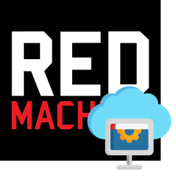

# Introduction 📖

==Goblin Tech stack== are open sources backend and set of tools to support it - for games, apps and websites of any platforms. Stack includes:

1. Goblin Base Server : https://github.com/red-machine-games/goblin-base-server
2. Goblin unnamed deploy tool (Not open sources yet!)
3. Goblin Base Benchmark : https://github.com/red-machine-games/goblin-base-benchmark
4. A set of client SDKs :
    1. Javascript : https://github.com/red-machine-games/goblin-javascript-asset
    2. Unity engine (C#) : https://github.com/red-machine-games/goblin-unity3d-asset

The idea of all stack is to let complex problems to be accomplished with casual javascript. You can use Goblin Backend as primary backend for your project or as secondary service for some features. Summing up it provides a bunch of features like authentication and schema-less profiles, grouping and leaderboards, real-time chat, matchmaking, pve and real-time pvp and all these features are available from cloud code - a JavaScript functions containing authoritarian logic.

Goblin Tech stack is developed within the walls of Red Machine Games studio for internal use. We passed a long way through many obvious and non-obvious issues and did a good job in providing set of enough universal and high quality features for the most requirements.

## Philosophy 🔭

{>>Goblin Base is not going to shift any of the existing popular Backend-as-a-service, moreover we have our own sight on ideal backend.<<}

{++Money++}. Our business model is to provide a hosted version and take all ops to ourself. Instead of taking money for whole bunch of metrics like ==DAU==, ==MAU==, ==CCU== or ==count of signed up users== Goblin Cloud will just give you a physical instance - usually it is a cluster of _DigitalOcean_💧 virtual machines. It is not so flexible as charging for every _DAU_, but in practice it leads to lower costs({>>about 10-20 times cheaper than a big company BaaS<<}).

{++Features++}. Instead of beeing everything in one Goblin Base following more highly specialized path. It has low amount of abstractions but keeping them as much universal and powerful as possible to let you developing your own abstractions and features in comfort. The whole Goblin Base backend tied on idea of cloud functions and atomic acts - you can do whatever you want with them. Instead of providing many utilitarian and marketing tools like analytics and A/B testing, we just letting you to make http requests to whitelisted APIs so you can just use Goblin Base along with your beloved tools. Moreover you can use Goblin Base just as part of your own system: run only servers with game logic and Goblin will do the rest.

{++Client plugins and assets++}. We understand how it's hard sometimes for client developers to work with backend and networking. Our goal is to provide as much comfortable plugins as possible.

{++Data++}. All the data of exact Goblin Cloud Server instance belongs to exact payer. He can order a backup at any working moment.

{++Source code++}. All particular products of Goblin Tech stack are available as open source repositories or will be in future. 

!!! note
	Check out our roadmap. We're trying to keep our plans transparent: [Roadmap](https://github.com/orgs/red-machine-games/projects/1)

## Features overview 🔑

- **Configuration**  
	Goblin Base Server has much of configuration options like numeric constants(features times), where to get resources, how much sessions should live, turning on or off direct profile exposure(for authoritarian), many credentials, min versions, hmac secrets and more.
- **Accounts and profiles** 
	To be flexible we offer 2 separated entities: account and profile. Account contains only login and link to profile and profile contains all your domain data. It's easy to have multiple accounts and single profile or multiple profiles and single account, it will give you an ability to link and login in multiple ways.
- **Grouping and chat**  _(WIP)_ 
	Group your users with some domain logic, implement rules and let them chat with each other: in-group or 1-to-1.
- **Leaderboards**  
	Post records into multiple segments and list leaders among group, social friends or overall.
- **Purchase validation**  
	Validate receipts from iOS and Android in-app purchases to prevent validation scam(when you trying to validate receips from mobile client and hackers imitate positive response from store server). Also you can work with purchases from social networks like VK or OK.
- **Matchmaking**  
	A matchmaking function makes it easy to connect players with each other using sets of parameters.
- **PvE and PvP**  
	We support room-based gameplay - you can matchmake players and redeem a room for them or just redeem a room for singleplay(PvE or player versus himself).
- **Cloud functions**  
	All features are available from cloud functions (or so-called server-side code). You can code authoritarian routes with JavaScript. Also you can program authoritarian and/or deterministic gameplay. You can upload your code on run and backend doesn't need to be rebooted (_Only for managed cloud_). Resources also available from server-side code so you can use the same json-encoded balance with client and server-side scripts.